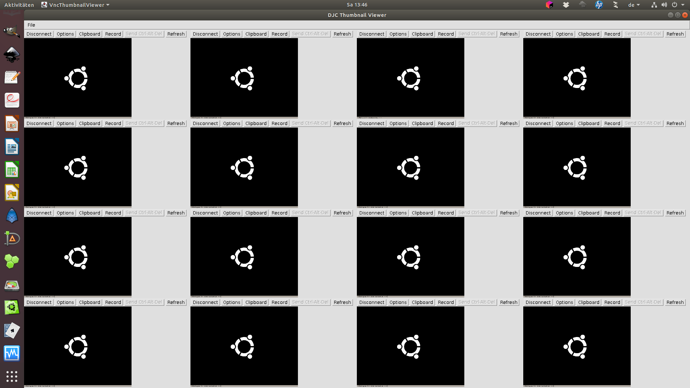

# Test Environment

## Tools Contained in the Test Environment

- [Docker](https://www.docker.com/) (with [Docker Compose](https://docs.docker.com/compose/))
- [PHPUnit](https://phpunit.de/)
- [Selenium Grid](https://www.selenium.dev/documentation/en/grid/) 3 (with [Firefox](https://hub.docker.com/r/selenium/node-firefox-debug), [Chrome](https://hub.docker.com/r/selenium/node-chrome-debug), [Opera](https://hub.docker.com/r/selenium/node-opera-debug) nodes)
- [PHP Webdriver](https://packagist.org/packages/php-webdriver/webdriver)
- [ParaTest](https://github.com/brianium/paratest)
- [VNC Thumbnail Viewer](https://thetechnologyteacher.wordpress.com/vncthumbnailviewer/)

## Monitoring the Tests

### Grid Console

To see the Selenium grid console, navigate to

```text
http://localhost:4444/grid/console
```

with your browser.

### See it Work

To see the screens of node containers, use

```bash
$ bin/view.php
```

It will open a new window with the downscaled screens of all nodes registered to the Selenium Hub.



Right-clicking into one of the thumbnails will open that screen in full size.